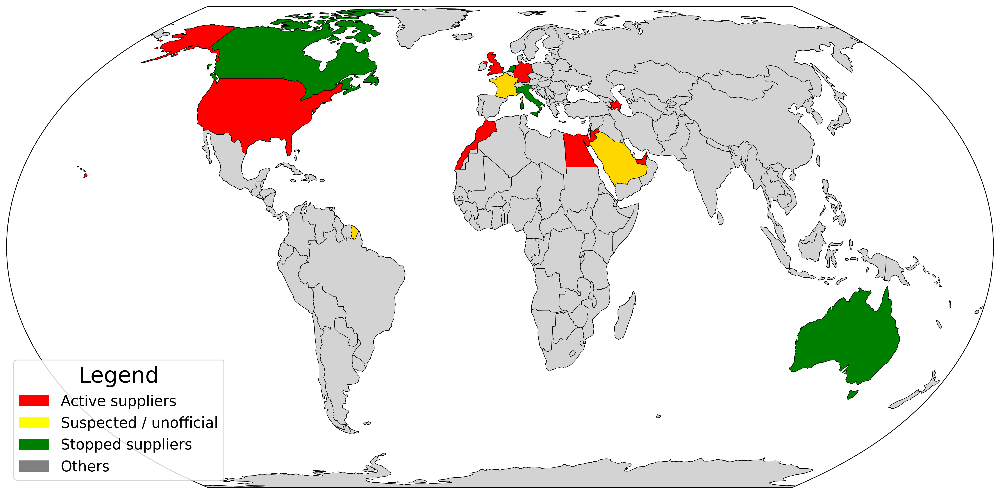
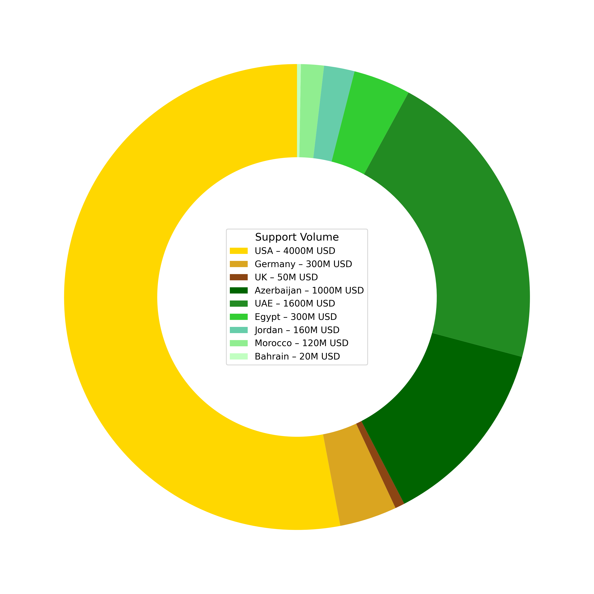

🕵️ Independent Anonymous Reporters -- September 2025

# HALL OF SHAME

## ISRAELI GENOCIDE SUPPORTERS

As of September 2025, countries supplying Israel can be divided into two clear groups.

1. **Western arms suppliers** – Primarily the United States, Germany, and the United Kingdom. These states continue to provide Israel with advanced weaponry, munitions, and critical defense components worth billions of dollars annually. Their role is direct and military in nature, sustaining Israel’s capacity for large-scale operations.  
2. **Arab civilian and intelligence suppliers** – States such as Egypt, Jordan, the United Arab Emirates, Bahrain, Morocco, and Azerbaijan (non-Arab but regional) maintain economic and security links. Their supply takes the form of oil, foodstuffs, construction materials, civilian goods, logistics, and intelligence cooperation. While not delivering arms, these flows nonetheless reinforce Israel’s resilience and global integration.

Together, these two groups – one supplying lethal force, the other supplying essential civilian and strategic support – highlight the layered networks that sustain Israel’s position despite ongoing genocide.

## **🔴 Red List – Active Suppliers**

These countries are actively and officially supplying Israel today – either weapons, energy, or significant civilian goods/services.

* **United States of America** – Arms (Lockheed Martin F-35, Boeing munitions, Raytheon missiles); billions in annual aid.  
* **Germany** – Arms (submarines, anti-tank rockets, ammo; though restricted for Gaza use since Aug 2025).  
* **United Kingdom** – Components (F-35 parts via BAE Systems, Rolls-Royce); licensed exports continue.  
* **Azerbaijan** – Oil (SOCAR crude via BTC pipeline; \~30–40% of Israel’s crude).  
* **Egypt** – Civilian goods (cement, food, textiles), energy services (LNG facilities for Israeli gas).  
* **Jordan** – Civilian goods (phosphates, fertilizers, textiles, food); mutual water/energy projects.  
* **United Arab Emirates (UAE)** – Civilian goods (aluminum, diamonds, oil re-exports, food), logistics, capital investment (Mubadala stake in Tamar gas).  
* **Bahrain** – Civilian goods (aluminum, steel, banking links; trade dipped but resuming).  
* **Morocco** – Civilian goods (sugar, textiles, fertilizers), plus intelligence/security cooperation.

## **🟡 Yellow List – Suspected / Unofficial Suppliers**

These states have no open supply but credible reporting suggests covert, indirect, or politically sensitive channels.

* **France** – Officially paused arms; still strong civilian trade (Airbus, Renault, Sanofi). Some NGO reports allege limited ammo deliveries in 2023–24, but not confirmed in 2025\.  
* **Saudi Arabia** – No official ties; normalization froze. Possible indirect supply (oil cargoes routed via UAE, shipping/airspace services). Nothing acknowledged.

## **🟢 Green List – Stopped Suppliers**

These countries previously supplied arms or goods but have officially suspended/terminated supply (usually citing Gaza war humanitarian concerns).

* **Italy** – Arms suspended Oct 2024 (Leonardo, Fincantieri past deals).  
* **Netherlands** – Arms suspended Feb 2024 after court ban on F-35 parts (e.g., GKN Fokker).  
* **Canada** – Arms permits frozen since Jan 2024 (Colt Canada, PGW rifles; indirect U.S. packages remain a loophole).  
* **Australia** – No current weapons; official statement: no arms sent since Oct 2023\.

✅ Grey (others) – Countries not on red/yellow/green lists have no notable supply relationship with Israel.

---

# Countries Supply Details 

## United States of America

* Status: Active primary supplier – The US remains Israel’s largest backer. It accounted for \~69% of Israel’s major arms imports in 2019–2023  and provides $3.8 billion annually in military aid under a 10-year, $38 billion MOU (2018–2028) . This financing has enabled Israel to procure F-35 stealth fighters, missile defense systems, and other advanced weaponry .  
* Top Suppliers & Contracts: Major U.S. defense firms are deeply involved. Lockheed Martin supplies the F-35 Lightning II jets (Israel had 36 of 75 F-35s delivered by 2024, funded by U.S. aid) . Boeing is a key contractor for munitions – for example, a June 2025 sale of JDAM bomb guidance kits (3,845 kits for BLU-109 and 3,280 kits for MK-82 bombs) worth $510 million was approved, with Boeing as principal contractor  . Raytheon (in partnership with Israel’s Rafael) co-produces Iron Dome interceptors and other missiles as part of U.S.-Israel joint defense projects . In early 2025, Washington also approved a massive $7.4 billion package of bombs, precision-guidance kits, and Hellfire missiles for Israel  , underscoring the ongoing supply of ammunition and high-tech arms.  
* Policy: The U.S. has no embargo on Israel – on the contrary, military support is a cornerstone of policy. There have been temporary pauses over humanitarian concerns (e.g. in May 2024 the Biden administration *suspended* a shipment of 1,800 2,000-pound bunker-buster bombs amid concerns about their use in Gaza’s dense urban areas  ). However, such holds have been short-lived. Billions in arms remain “in the pipeline” for delivery , and the U.S. publicly emphasizes Israel’s right to self-defense. In sum, as of 2025 the U.S. continues robust supplies of weapons, technology, and funds to Israel (while occasionally calibrating deliveries to press for compliance with humanitarian law ).

## Germany

* Status: Active supplier (with new restrictions) – Germany is Israel’s second-largest arms source, responsible for about 30% of Israel’s imported weaponry in 2019–2023 . It historically provided critical hardware and technology. For example, German shipbuilder ThyssenKrupp Marine Systems has built Israel’s *Dolphin*\-class submarines (with German government subsidies), and companies like DIEHL Defence and Rheinmetall have supplied missiles, ammunition and tank parts. In 2023, German export approvals to Israel spiked nearly tenfold – €326.5 million in arms, up from \~€33 million in 2022  – as Berlin fast-tracked support after the October 7 Hamas attack. This included 3,000 portable anti-tank weapons and 500,000 rounds of ammo approved for export , alongside air-defense components and communications gear .  
* Top Suppliers & Materials: Notable German contributions are in high-end systems and components. ThyssenKrupp’s submarines enhance Israel’s naval capabilities (including second-strike nuclear deterrence). German manufacturers have provided tank engines (for Merkava tanks), naval guns, and patrol boats in past deals. Rheinmetall and Dynamit Nobel have been cited for anti-armor munitions. Many of these are sold under government-to-government arrangements backed by Germany’s historical commitment to Israel’s security. In 2023, Germany also rushed deliveries of ammunition and anti-tank rockets to replenish Israeli stocks  .  
* Policy Shift: Temporary export suspensions were introduced amid the Gaza war. In early 2024, as Israeli operations in Gaza drew international scrutiny, Berlin sharply slowed approvals of new arms deals – only €14.5 million approved from Jan–Aug 2024, versus the previous year’s hundreds of millions  . By August 2025, the German government formally announced it *“will not authorize any exports of military equipment that could be used in the Gaza Strip until further notice”*  . This effectively suspends deliveries of weapons that might be deployed in Gaza, citing concerns over potential German complicity in violations of international humanitarian law. The decision – influenced by domestic legal challenges and Green Party pressure within the coalition – came after evidence of mounting civilian casualties in Gaza  . It is a conditional pause (focused on Gaza use); Germany has not completely severed defense ties. Deliveries unrelated to the Gaza campaign (e.g. submarines or systems for Israel’s territorial defense) could still proceed case-by-case  . The overarching reason is political and legal: Germany’s post-Holocaust support for Israel is now being balanced against humanitarian concerns, leading to this partial embargo in late 2024–2025.

## United Kingdom

* Status: Active supplier (components and licenses) – The UK is not among the very top suppliers by volume, but it does provide important parts and specialized equipment to Israel’s military. Britain doesn’t give arms as aid; instead, it licenses private companies to export. From 2017–2023 the UK approved a significant number of export licenses for Israel – over 100 licenses in the months following Oct 2023 alone . In 2022, the UK granted at least £42 million worth of defense export licenses to Israel, covering items like aircraft components, drones, munitions, small arms ammunition, and targeting equipment . Many British-made parts end up in U.S. platforms used by Israel. For instance, BAE Systems (Britain’s largest defense firm) produces an estimated 15% of the componentsof every F-35 fighter jet . These British-made F-35 parts – from avionics to fuselage sections – equip Israeli Air Force jets that have been used in Gaza strikes . Other UK companies supply sub-systems such as jet engine components (Rolls-Royce contributes to the F-35’s engine) and targeting electronics.  
* Types of Supplies: The UK’s exports are often dual-use or components rather than complete weapon systems. Examples include components for UAVs (unmanned aerial vehicles), spare parts for aircraft and tanks, sniper rifle parts, and cryptographic/security software. The UK has also exported categories of finished arms: sniper rifles, anti-riot gear, and armored vehicle components (per historically released license data). Much of this trade is indirect – e.g. British parts incorporated into American weapon systems sold onward to Israel. One notable direct sale was the UK’s Watchkeeper UAV (developed jointly by Israel’s Elbit Systems and Thales UK), although primarily for UK use, some technology transfer goes both ways.  
* Policy and Debates: No full embargo is in place, but the UK government claims to apply one of the “world’s strictest” arms control regimes . In practice, Britain has continued licensing arms to Israel during the Gaza war, arguing they’ve seen no clear risk of breach of international law . In early September 2024, the UK did suspend 30 out of \~350 active export licenses for Israel as a precaution, over concerns those items *“could be used to commit serious violations of IHL”* . (These were believed to involve specialized munitions and components potentially usable in Gaza). However, investigations by civil society found that even after this partial suspension, some UK-made munitions secretly continued to reach Israel . The British High Court weighed in as well – in June 2025 it ruled lawful the government’s decision to keep exporting F-35 parts to Israel, rejecting an activist challenge . Political pressure within the UK to halt arms to Israel is strong (polls show \~58% of Britons support an embargo during the Gaza war) . Yet as of 2025, the UK’s official line is that it will continue “defensive” exports to Israel. Ministers stress the importance of Israel being able to defend itself, and claim to review each license to ensure compliance with humanitarian law  . In summary, Britain is still supplying Israel (mainly via industry) – with key British-made components for jets and other systems – while fending off domestic calls to stop. Any restrictions so far have been limited and largely *temporary*.

## Italy

* Status: Supply suspended – Italy was historically among Israel’s top three arms suppliers (though a distant third). It accounted for roughly 1% of Israel’s arms imports in recent years , delivering niche capabilities. For example, Italian aerospace firm Leonardo (formerly Finmeccanica) sold Israel M-346 *Lavi* advanced trainer jets, and Fincantieri/OTO Melara provided naval artillery for Israeli ships. In 2022–23 Italy exported small arms, ammunition, and parts to Israel valued around €13.7 million . Notably, in *December 2023 alone*, during the Gaza conflict, Italy still sent about €1.3 million in arms to Israel – triple the amount from December 2022  (likely fulfilling prior contracts).  
* Pause on New Exports: Amid the Gaza war, Italy imposed a de facto arms freeze. An Italian Foreign Ministry source confirmed that as of October 2023 “everything stopped” – no new export licenses were approved once the war began . The government allowed only previously agreed orders to be delivered (the last shipments went out by November 2023\) . Then in October 2024, Rome announced it had suspended all further shipments of military equipment to Israel . This suspension covers any outstanding deliveries not yet executed. Italy’s Economy Ministry and customs authorities are effectively blocking new arms transfers to Israel for the duration of the conflict.  
* Reasoning: Italy’s stance is grounded in its domestic law and human rights concerns. Italian export law prohibits arms sales to countries engaged in active war or found to violate human rights . As images of civilian suffering in Gaza emerged, Italy’s governing coalition (despite being generally pro-Israel) had to heed legal and public pressure. Defense Minister Guido Crosetto stated in early 2024 that while Italy would honor existing contracts to Israel, each was being reviewed to ensure the weapons *“would not be used against Gaza civilians”* . By late 2024, with international outcry growing, Italy leaned on the side of caution and halted new arms exports entirely. This policy remains in place as of Sep 2025 – effectively an arms embargo on Israel until the war subsides. No Italian court ruling was needed; it was a political decision aligning with Italy’s legal framework and widespread European calls for restraint. It’s worth noting Italy continues non-military trade with Israel (technology, automotive, etc.), but in the defense realm, ties are on hold for now.

## Netherlands

* Status: Supply suspended – The Netherlands has stopped exporting arms to Israel due to the Gaza war. Although the Dutch contribution to Israel’s military supply is relatively small, the Netherlands was involved mainly via components (for instance, Dutch industry partners on the F-35 fighter program supply parts that could end up in Israeli jets). In 2024, the Dutch government took the step of ending all military shipments to Israel over concerns that Dutch equipment might be used in violations of international humanitarian law . This followed reports of high civilian casualties in Gaza.  
* Legal Action: The suspension in the Netherlands was reinforced by a court ruling. In February 2024, a Dutch court in The Hague imposed a ban on delivering F-35 parts from the Netherlands to Israel . The case, brought by human rights groups, argued that exporting components for Israel’s F-35s made the Netherlands complicit in potential war crimes (since those jets conduct strikes in Gaza). The court found merit in the claim that there was a “clear risk” of Dutch exports being used in unlawful ways, and it ordered the government to halt such deliveries. As a result, items like advanced radars, engine parts, and electronic components for fighter aircraft – which Dutch firms (e.g. GKN Fokker or ASML in the microelectronics domain) help produce – are no longer sent if destined for Israel’s use . The government has complied, effectively freezing all defense exports to Israel.  
* Policy Context: The Dutch decision is part of a broader stance. The Netherlands joined a handful of European countries (Belgium, Spain, Italy, etc.) in publicly suspending arms exports to Israel after October 2023 . Dutch officials cited the fear of Israeli weapons being used against civilians in Gaza as the primary motive . By cutting off supply, the Netherlands positions itself in line with international humanitarian obligations. As of Sept 2025, this suspension remains in effect – no Dutch-made military goods or dual-use tech are actively supplied to Israel. Regular commercial trade (flowers, electronics, etc.) continues as normal, but anything with a potential military end-use is being blocked.

## Canada

* Status: Supply suspended – Canada has effectively banned new military exports to Israel since early 2024\. Historically, Canada’s direct arms sales to Israel were modest but not zero. (For example, Canadian authorities quietly approved at least CAD $21 million in arms licenses to Israel in late 2023, including categories like “bombs, rockets and other explosive devices,” before policy shifted .) Canadian-made products, such as General Dynamics’ subsidiary in Quebec manufacturing ammunition, have been part of Israel’s supply chain. In one case, as late as August 2024, a U.S.-approved arms package for Israel included munitions produced in Canada  – highlighting that Canadian arms can reach Israel indirectly.  
* Export Ban: Following the Gaza war outbreak, Canada imposed a strict halt on arms permits to Israel. Then-Foreign Affairs Minister Mélanie Joly announced that no new permits for “controlled goods” to Israel have been approved since January 2024  . She specified that Canada *“froze all existing permits in 2024 that could have allowed military components to be used in Gaza”*, and those permits remain suspended . In total, roughly 30 export licenses were frozen . Canada’s position is unequivocal: *“We will not allow Canadian-made weapons to contribute to this conflict,”* as Minister Anita Anand reiterated in August 2025  . This means Canadian defense companies (e.g., Colt Canada for rifles or PGW Defence for sniper rifles) are barred from sending hardware to Israel. Even dual-use items are under scrutiny if they could aid Israel’s military in Gaza.  
* Reasoning: The Canadian government’s move came after a parliamentary vote in the House of Commons (March 2024\) calling for alignment with an International Court of Justice opinion on Israel . Essentially, lawmakers urged the government to ensure Canada isn’t facilitating possible war crimes. Public pressure was also a factor – Canadian civil society and human rights groups demanded a halt to arms trade with Israel (a lawsuit was filed in March 2023 by advocates seeking to block any military exports ). In response, Canada took what it calls a *“hard line”*: if an item *could* be used in Gaza, it’s not getting a permit  . Ottawa emphasizes that this is about upholding international humanitarian law. As of Sept 2025, this policy is still in force. No lethal equipment is knowingly being shipped from Canada to Israel. (It’s worth noting, however, that Canadian arms could still reach Israel via third countries like the US, as seen in the $20 billion US-brokered package that included Canadian-made munitions  – an issue Canadian officials have faced criticism for.)

## Australia

* Status: Minimal supplier (no current arms trade) – Australia has no significant record of arming Israel in recent years. While there were 322 approved defense export permits from Australia to Israel over a six-year period  (likely small components or dual-use goods), the volume and value were relatively low. Australia’s contributions, historically, might include things like protective equipment, rifle parts, or radar components, but there are no high-profile deals publicly known. Importantly, since the Gaza conflict began in Oct 2023, Australia has not sent any weapons to Israel. Foreign Minister Penny Wong confirmed that Australia *“has not given weapons to Israel since the start of the Gaza war.”*  This suggests that even previously licensed exports (if any) were put on hold.  
* Transparency & Pressure: Australia’s arms export system is notoriously secretive (approvals often aren’t disclosed in detail), which has drawn criticism. The Australian Greens’ defense spokesperson, Senator David Shoebridge, has pressed the government to reveal what had been sent to Israel before the war . Meanwhile, Amnesty International and other NGOs have urged Canberra to explicitly halt all arms sales to Israel , citing the humanitarian crisis in Gaza. The government’s response has essentially been to reassure that nothing lethal is currently being exported to Israel. Minister Wong’s statement in late 2023 indicates a de facto pause on any military shipments.  
* Current Relationship: As of 2025, Australia’s direct support to Israel is diplomatic and intelligence-oriented rather than through goods. Australia continues to trade civilian products with Israel (the two have a modest trade in education, agriculture, and technology). For example, Australian-origin products like alumina (for Israel’s aluminum industry) or beef and wheat are likely exported as part of normal commerce. But no arms or ammunition are flowing. Australia has not needed to implement a formal embargo because arms sales were small to begin with; nonetheless, it aligns with allies in expressing concern over Gaza. In summary, Australia is not actively supplying Israel with military goods in 2025\. Any past minor exports have been suspended out of caution, consistent with Australia’s public stance of urging humanitarian pauses and compliance with international law.

## Azerbaijan

* Status: Active supplier (energy) – Azerbaijan is a critical supplier of oil to Israel. In the absence of local petroleum resources, Israel has relied on Azerbaijani crude for decades. Baku provides an estimated 30–40% of Israel’s crude oil imports . For instance, in 2023 Israel imported roughly 267,000 barrels per day of crude; a large portion of that came from Azerbaijan’s fields in the Caspian region . In dollar terms, Azerbaijani exports to Israel were about $1.4 billion in 2023  (mostly oil), and even in war-torn 2024 they remained significant (\~$733 million by official stats) . The oil is transported via the Baku–Tbilisi–Ceyhan (BTC) pipeline to Turkey, then shipped by tanker to Israel’s Mediterranean ports. SOCAR, Azerbaijan’s state oil company, and trading firms handle these deliveries.  
* Top Commodity & Companies: SOCAR (State Oil Company of Azerbaijan Republic) is the primary entity exporting Azeri Light crude. It often uses intermediaries: for example, traders like Vitol or Trafigura might handle tanker shipments. Azerbaijan also supplies Israel with condensate and oil products to some extent. Beyond oil, there is some cooperation in energy infrastructure – e.g., Israeli firms have invested in Azerbaijan’s gas sector, and Azerbaijan’s Azercosmos sold satellite services to Israel – but oil is the mainstay. Notably, no weapons flow from Azerbaijan to Israel; rather, the strategic relationship is reciprocal (Israel is a major arms supplier to Azerbaijan, including drones and missiles). Azerbaijan’s “goods” to Israel are thus essentially fuel and possibly agricultural products (Azerbaijan exports fruits and cotton worldwide, some of which reach Israel).  
* Continued Supply Despite Politics: Even during heightened conflict periods, Azerbaijan has quietly maintained oil supplies to Israel. In late 2023, under pressure from Turkey (which opposed Israel’s actions in Gaza), Azerbaijan removed Israel from its official customs export reports, giving the appearance it halted oil sales . In October 2024, official data showed zero Azerbaijani oil going to Israel . In reality, deliveries continued clandestinely. Israeli and Azeri officials confirmed that oil flows were rerouted through third parties to obscure their origin . For example, tankers like the *Kimolos* and *Seavigour* made multiple voyages from Ceyhan (Turkey) to Israel in 2024, but on paper the oil was “sold” to another country to bypass the public embargo . *“We received a promise from the Azerbaijanis that the strategic relations will continue, including in the energy sector, and we have nothing to worry about,”* an Israeli source told *Haaretz* . Indeed, by mid-2025, roughly 1 million+ tons of Azeri oil had reached Israel through these shadow arrangements   – comprising nearly a third of Israel’s oil supply . In summary, Azerbaijan is still actively supplying Israel with vital oil, using creative logistics to dodge political backlash. There have been no announced cut-offs in services; energy trade remains a cornerstone of the Azerbaijan-Israel alliance (often dubbed a “strategic oil-for-arms” partnership).

## France

* Status: Limited supplier (civilian trade; arms largely absent) – France does not currently supply significant weapons to Israel. Unlike the US or Germany, French arms sales to Israel have been minimal in recent decades, in part due to France’s embargo after 1967 and Israel’s shift to U.S. suppliers. By 2020s, France’s share in Israel’s arms imports is negligible (France isn’t listed among the top suppliers in recent SIPRI reports ). French-made military systems in Israel are mostly legacy or indirect – e.g. older *Dassault Mirage* aircraft from the 1960s (long retired) or French components within European systems that Israel buys (like Airbus helicopter parts or Safranavionics). During the Gaza war, France has *politically* distanced itself from arming Israel. On October 5, 2024, President Emmanuel Macron called for halting arms deliveries to Israel, stating *“the priority is… stop delivering weapons to fight in Gaza”* . This was a clear signal that France would not approve any new military exports that could be used by Israel in the conflict. (France also pushed for humanitarian pauses and emphasized diplomatic solutions).  
* Types of Goods Supplied: Civilian and dual-use goods form the bulk of France–Israel trade. France is a major trading partner in the EU context – French companies export pharmaceuticals, luxury consumer goods, automobiles, industrial machinery, and agricultural products to Israel. For instance, French brands like Renault(cars), Sanofi (medical supplies), or LVMH (cosmetics, fashion) have active markets in Israel. Additionally, Airbus (a French-European firm) supplies passenger aircraft to Israeli airlines and satellites for space cooperation – these are services and goods France continues to provide. Any technology with a potential military application is evaluated case-by-case. One area of caution is cybersecurity and spyware: French regulators keep an eye on exports of advanced surveillance tech that could be misused (though Israel typically is an exporter of such tech, not importer).  
* Policy: The current policy is effectively a political ban on arms, though not codified in law as a formal embargo. France’s Defense Ministry isn’t known to have any active contracts delivering weapons to Israel in 2024–2025. Macron’s public stance  aligns France with the broader European sentiment urging restraint. France’s focus is on humanitarian issues and reviving a peace process; continuing or initiating arms sales to Israel during the Gaza campaign would undercut that message. Furthermore, France is not *needed* as an arms supplier given Israel’s other sources, so this stance costs Paris little strategically. In summary, France *still trades* with Israel in the economic sense – e.g. bilateral trade was over $2 billion in goods in 2022 (mostly non-military) – and French companies (TotalEnergies, Alstom, etc.) engage in Israel on energy and infrastructure projects. But when it comes to goods or services of a military nature, France in 2025 is holding back. The “freeze” on weapons is motivated by political signaling (ceasefire advocacy) and to avoid domestic backlash. No known court rulings forced this; it’s a policy choice. France’s stance could evolve if the conflict abates, but as of Sep 2025, there is no active French armaments supply to Israel, only ongoing civilian commerce.

## Egypt

* Status: Active supplier (civilian goods & cooperation) – Egypt has a peace treaty with Israel (since 1979\) and maintains a careful but ongoing economic relationship. While Egypt does not supply weapons to Israel, it does provide goods, commodities, and critical services in the energy sector. In fact, surprisingly, Egyptian exports to Israel have increased during the Gaza war period. In the first half of 2024, Egypt’s exports to Israel surged by \~50% year-on-year  . In May 2024 alone, Egyptian exports were $25 million – double the value from May 2023 . By some estimates, 2024 Egyptian exports to Israel reached $284 million  (up from \~$225 m in 2023), indicating growth. These exports include chemicals (e.g. phosphates, fertilizers), cement and building materials, agricultural produce (such as fruits and grains), and textiles. Egypt’s Sinai quarries and factories send materials used in Israel’s construction industry, and Egyptian cotton textiles find their way into Israeli apparel markets (often via the Qualifying Industrial Zones program). Also, food products like fish and dates are traded.  
* Energy & Services: A major aspect of Egypt-Israel ties is energy cooperation, where Egypt functions as both a customer and a service provider. Natural Gas: Israel exports natural gas from its offshore fields (Leviathan, Tamar) to Egypt – about 13.4% more gas in 2024 than 2023 (total \~13.1 bcm) for Egypt’s use and re-export . In turn, Egypt provides LNG liquefaction facilities at Idku and Damietta that allow Israeli gas to be processed and sold globally. In August 2025, Egypt went further and extended a massive gas import deal with Israel through 2040, a deal valued up to $35 billion  . Under this arrangement, Israeli gas flows to Egypt (boosting Egypt’s LNG hub ambitions), effectively meaning Egypt is *supplying a service* (LNG infrastructure) to Israel’s energy sector. Fuel:Historically, Egypt supplied Israel with oil under the peace accords (in the 1980s), but today Israel sources oil elsewhere. Instead, Egypt sometimes supplies electricity to Gaza in coordination with Israel, and there are talks of Egypt-Israel power grid links which could involve mutual supply in emergencies. Water: There is also a water-sharing component (Israel sells water to Jordan which frees up some of Jordan’s resources for Egypt’s use, etc., under regional agreements). While not direct “supply to Israel,” it’s part of a cooperative resource network involving Egypt.  
* No Arms, Political Stance: Egypt categorically does not export arms to Israel – doing so would be politically untenable domestically. In fact, Cairo has taken steps on the opposite front: in 2023, Egypt joined a letter with other nations urging a ban on weapons exports to Israel that could be used against Palestinians . The Egyptian government, while maintaining its treaty, vocally supports the Palestinian cause. During the Gaza war, Egypt’s President al-Sisi condemned Israeli military actions and even convened summits for Gaza aid – but notably kept the Egypt-Israel border coordination intact (for humanitarian crossings) and did not sever trade. The Rafah crossing between Egypt and Gaza is operated in consultation with Israel for aid – another “service” Egypt provides in managing regional stability. In summary, Egypt is still supplying Israel with non-military goods and vital energy/logistical services. Trade in everyday goods actually rose amid the war (e.g., Egyptian monthly exports doubling year-on-year in late 2023\) . The current policy is to separate economics from politics: Egypt adheres to its peace agreement obligations and mutual economic interest (national “returns” as officials say ), even as it politically opposes Israel’s Gaza offensive. No ban on Egyptian exports exists, aside from arms which were never on the table.

## Jordan

* Status: Active supplier (civil goods; no arms) – Jordan, like Egypt, has a peace treaty with Israel (since 1994\) and engages in trade, though at a smaller scale. Jordan’s exports to Israel have been growing steadily. In 2023, Jordan exported about $161 million worth of goods to Israel , and 2024 saw further increases. By May 2024, for example, Jordan’s monthly exports to Israel were $35.7 million, up from $32.3 million in May 2023  . Over the past 5 years, Jordanian exports to Israel have risen at an annualized rate of \~11% . Principal exports include potash and phosphates (Jordan and Israel are both major fertilizer producers – they sometimes sell to each other or swap to meet contracts), chemicals, textile products (garments from Jordan’s factories), and agricultural produce. Notably, Jordan’s vegetables and fruit (e.g. dates, olives) find markets in Israel especially when out-of-season locally. There is also a Qualified Industrial Zone scheme where Jordanian-made goods with Israeli inputs enter the U.S.; this fosters indirect supply chain links between Jordan and Israel.  
* Energy & Water Exchanges: Jordan and Israel have a complex exchange system: while Israel supplies Jordan with natural gas (from the Leviathan field, under a $10 billion deal signed in 2016, which in 2024 delivered increased volumes to Jordan’s power plants ), Jordan in turn might supply Israel with solar energy in the future. A 2021 UAE-brokered plan (“water-for-energy”) envisions Jordan building solar farms to export electricity to Israel, and Israel providing Jordan with desalinated water – a project still under negotiation in 2025\. For now, Israel already sells water to Jordan (per treaty quotas), and Jordan provides some agricultural labor and know-how to Israel’s farms (seasonal worker arrangements). These are more *services* and swaps than direct “goods,” but they underscore active cooperation.  
* No Arms Supply: Jordan does not send weapons to Israel. Its military is equipped by the US and others, and there is no history of Jordanian arms exports abroad (Jordan mostly imports or manufactures for itself). In fact, during the Gaza war, Jordan took a very critical stance against Israel’s actions – King Abdullah II was outspoken in condemning the bombing of civilians. Jordan recalled its ambassador from Tel Aviv in 2023 as a protest (and also pushed Israel’s ambassador out temporarily). Additionally, Jordan has joined international calls, such as votes at the UN General Assembly, pressing for a ceasefire and arms embargo on Israel. Internally, public sentiment in Jordan is strongly pro-Palestinian, which constrains overt cooperation. However, Jordan did not cut off trade or its peace treaty obligations. The current policy is to maintain diplomatic and economic ties with Israel (to preserve regional stability and U.S. relations), but to freeze any new strategic initiatives. For instance, a major Israel-Jordan-Saudi railway project and the aforementioned solar-water deal were put on hold amid the war’s tension. In summary, Jordan continues to supply Israel with civilian goods and engages in mutual economic projects, while refraining from any military support. The reasons behind no arms supply are both legal (Jordan’s treaties don’t require any security aid to Israel) and political (solidarity with Palestinians and avoiding inflaming domestic unrest).

## United Arab Emirates (UAE)

* Status: Active supplier (trade & tech) – The UAE has robust and growing ties with Israel since the 2020 Abraham Accords. It is actively supplying Israel with a range of goods, investment capital, and services. By 2023, the UAE’s exports to Israel reached about $1.65 billion  (UN COMTRADE data) – a massive increase from virtually $0 pre-normalization. Trade has continued despite the Gaza war. In fact, UAE exports to Israel hit $242 million in May 2024, slightly up from $238.5 m in May 2023 , indicating no significant slowdown . The top export categories are oil and petrochemicals, raw materials, and high-tech goods. For example, raw aluminum from UAE (Emirates Global Aluminium) and diamonds (Dubai is a diamond re-export hub) are big trade items – Israel’s diamond industry sources rough stones via UAE exchanges. The UAE also exports consumer products(electronics, appliances) and foodstuffs (dates, processed foods) to Israel.  
* Key Companies & Deals: Several prominent Emirati companies are engaged in supplying Israel or partnering on projects:  
  * Mubadala Investment Co. – Abu Dhabi’s sovereign fund – bought a 22% stake in Israel’s Tamar gas fieldin 2021, injecting capital and effectively “supplying” investment into Israel’s energy sector . Mubadala and other UAE energy firms (like ADNOC) also supply oil indirectly. There was an oil transport memorandum: in 2020, Israel’s Europe-Asia Pipeline Co (EAPC) signed a deal with Abu Dhabi-based Petromal to use Israel’s Eilat-Ashkelon pipeline for transiting Emirati oil to the Mediterranean . Though environmental concerns in Israel stalled this, the Gaza war led Israel to temporarily ease restrictions, seeking more oil flow via Eilat  . The internal estimate was this UAE-Israel oil transit could be worth $50 million a year in revenue  – showcasing how Gulf oil might supply Israel (either for domestic use or re-export) if fully realized.  
  * DP World – Dubai’s ports giant – has a cooperation with Israel in shipping. After 2020, DP World partnered with an Israeli firm to bid on port privatizations and to develop the Jebel Ali–Haifa shipping route, facilitating more trade. This means the UAE is *supplying logistics services* for Israel’s trade.  
  * Emirates Airlines & Etihad – began direct flights to Tel Aviv in 2021, providing passenger and cargo services. While temporarily, some flights were paused during the height of Gaza war tensions, air links resumed, meaning the UAE continues to *supply connectivity and tourism* to Israel.  
  * Technology and Defense – Interestingly, while Israel is usually the exporter of defense tech, the UAE has become a partner: e.g., the UAE’s EDGE Group (a defense conglomerate) has MOUs with Israeli firms on R\&D. The UAE supplies Israel with collaboration in areas like AI, renewable energy, and space (the two have a joint Venus satellite project). In terms of dual-use, some Israeli companies even relocated drone production to the UAE. So the UAE “supplies” manufacturing base and investment for Israeli defense indirectly, though not weapons per se *to* Israel.  
* Policy: The UAE has not imposed an embargo or cut trade with Israel after the Gaza war – but it has balanced optics. The Emirati government did express strong criticism of Israeli airstrikes and temporarily recalled its ambassador for consultations in Oct 2023\. High-level visits were postponed. Yet, economic ties remained intact. UAE officials signaled that isolating Israel economically was not their approach. As evidence, UAE-Israel trade in 2024 actually rose overall (reports show a \~++ year-on-year increase for the first half of 2024\) . The Abraham Accords free-trade negotiations also continued, culminating in a UAE-Israel CEPA (Comprehensive Economic Partnership Agreement) that came into force in 2023 to eliminate tariffs – a framework still operational in 2025\. In short, the UAE continues to actively supply goods, capital, and services to Israel. There are no budgetary restrictions announced on these transfers (for instance, UAE’s ministries have not canceled the multi-billion-dollar investment deals with Israeli tech funds). The ongoing cooperation underscores that the UAE separates political disagreement (it condemned the humanitarian toll in Gaza) from the normalization gains. The only area of caution: the UAE likely held off on *new* big defense purchases from Israel (to avoid public backlash), but that doesn’t affect what the UAE supplies to Israel. Therefore, as of September 2025, the UAE’s policy is *business-as-usual* with Israel, making it a key new supplier of certain goods (like oil, via re-exports, and high-tech components) and especially a facilitator of Israel’s integration into global trade networks .

## Bahrain

* Status: Active supplier (limited trade, briefly paused) – Bahrain, a smaller Gulf state, established official relations with Israel in 2020\. The scale of Bahrain’s direct exports to Israel is relatively small but growing rapidly from a near-zero base. In 2023, Bahrain’s exports to Israel were about $16.5 million  (or up to $8 million according to some datasets  – figures vary, but all are modest). The main Bahraini goods sent to Israel have been raw aluminum (about $6.7 m worth, as Bahrain has one of the world’s largest aluminum smelters) and iron and steel products (\~$6 m, e.g. iron billets) . Bahrain also exports some chemicals and electronics to Israel, and there’s growing cooperation in financial services (Bahrain’s banking sector engages with Israeli fintech). By 2024, bilateral trade (both directions) in the first five months reached $54 m – a 933% increase over the same period a year prior . This indicates Bahrain was actively supplying and trading with Israel up until the Gaza war escalation.  
* Gaza War Impact: In October 2023, as images from Gaza sparked anger in the Arab world, Bahrain’s government had to respond. Bahrain’s parliament (Council of Representatives) – which is consultative – issued a tough statement calling to halt economic ties and recall diplomats . Indeed, Bahrain’s ambassador in Israel was brought home, and the Israeli ambassador in Manama left Bahrain around the same time  . Additionally, direct flights between Manama and Tel Aviv (which had been launched by Gulf Air) were suspended by late 2023  . However, it’s critical to note: the Bahraini government itself did not formally abrogate the normalization or trade agreements . The foreign ministry did not confirm a full severance of economic ties despite parliamentary claims . In practice, a cooling-off occurred – government-to-government initiatives went quiet, and any new deals were paused. But existing commercial relationships likely persisted quietly. For example, shipments of aluminum or other materials from Bahrain’s private sector to Israel may have continued via third ports or resumed once immediate tensions eased. Bahrain’s parliament has no binding power over trade policy , and by early 2024 Bahrain’s leadership signaled interest in keeping bridges open (e.g., the finance minister in Nov 2023 said it’s important to “continue to build bridges” regarding the Accords)  .  
* Current Status (2025): By August 2025, there were signs of normalization resuming momentum – Bahrain formally received an *new* Israeli ambassador’s credentials in Manama  , indicating diplomatic relations are back on track. This paves the way for trade to pick up again. So, as of Sept 2025, Bahrain is still (or again) supplying goods to Israel, though at a low volume. No known Bahraini arms are supplied (Bahrain’s own military relies on U.S./UK equipment; it doesn’t export arms). The exports are civilian, and Bahrain’s rulers likely calculate that maintaining ties with Israel serves strategic interests (countering Iran, pleasing allies) even as they manage public opinion. In summary, Bahrain had a temporary pullback but did not permanently end trade. It continues to export materials like aluminum and iron to Israel . Any financial or tech services cooperation that was on hold is expected to resume. The official reason given for the brief suspension was solidarity with Palestinians and opposition to the Gaza bombing  – *“confirming Bahrain’s historic position in support of the Palestinian cause,”* as the parliament put it . But this did not translate into a long-term ban. Bahrain’s policy now is to quietly normalize full economic relations again, aligning with its Abraham Accords commitments while hoping the situation in Gaza stabilizes.

## Morocco

* Status: Active supplier (civil goods & intelligence cooperation) – Morocco normalized ties with Israel in late 2020 and has since seen booming trade with Israel. In 2023, Morocco’s exports to Israel roughly doubled from the year before, reaching about $116–118 million . (For context, 2022 was around $50–60 m; 2023’s $118 m marks the highest ever, making Israel one of Morocco’s more notable new markets  .) Morocco’s export basket to Israel is diverse: the largest item is raw sugar (e.g., Moroccan sugar worth $43.6 m went to Israel, perhaps for Israel’s food processing industry) . Other significant items are textiles/apparel – Morocco sent about $16.6 m in non-knit women’s suits and clothing to Israel in 2023 , leveraging its garment factories. Additionally, phosphate fertilizers(Morocco is a phosphate superpower) likely feature – Israel’s agriculture can use imported phosphate, and while Israel also produces phosphates, it imported some from Morocco (trade data show Israel buying Moroccan mineral products). Electronics and machinery components also flow given Morocco’s growing automotive and aerospace sectors (some Israeli tech companies source parts or assembled products from Moroccan plants). By mid-2024, trade was still climbing – bilateral trade hit $53.2 m in the first half of 2024, 64% higher than the same period in 2023 . So Morocco has been actively supplying more to Israel *even during* the Gaza war.  
* Strategic Cooperation: Beyond goods, Morocco “supplies” Israel with valuable strategic partnership – particularly in intelligence and security. While this isn’t a good or service in the traditional sense, it’s worth noting: during the Gaza conflict, Morocco did not distance itself from Israel behind closed doors. In fact, security ties grew closer. Moroccan and Israeli officials share intelligence on threats like Iran and Hezbollah. Morocco perceives a common enemy in Algeria-backed Polisario rebels and Iran, especially after alleged Iranian arms reached the Polisario. On October 7, 2023 (the day of the Hamas attack), Morocco reportedly saw a warning example of how an Iranian proxy could strike (comparing Hamas with Polisario)  . This drove Morocco’s security establishment closerto Israel, not farther  . Throughout 2023–2025, Israel has in turn supplied Morocco with weapons (drones, anti-drone systems, Barak missiles, and even agreed on a $500 m drone factory in Morocco)  . Morocco extradited a terror suspect to Israel in 2024 – a gesture of deepening cooperation . All this underscores that Morocco sees value in maintaining ties.  
* Policy and Public Opinion: Publicly, Morocco had to manage optics after the Gaza war outbreak. The Moroccan populace strongly supports Palestine; there were large street protests and demands to cut ties. The government responded by toning down visible diplomacy – e.g., postponing high-profile visits, and loudly calling for a ceasefire and two-state solution . Morocco’s Parliament even considered a bill to criminalize normalization (largely symbolic). However, Morocco did NOT sever trade or diplomatic relations with Israel. It kept its liaison office open. Behind the scenes, collaboration never stopped  . In practical terms, no export bans were announced. Moroccan businesses continued fulfilling orders to Israel. For instance, Morocco World News reported trade in June 2024 was $8.5 m, up 124% from June 2023   – despite the war raging. This implies the government quietly allowed commerce to proceed. The rationale is that Morocco’s “higher interests” (containing Iran, securing US support on Western Sahara, and benefiting from Israeli technology) override the pressure to cut economic ties  . Thus, as of September 2025, Morocco is very much still supplying goods to Israel – from sugar to textiles – under an officially warm relationship. It has no arms embargo or trade ban in place vis-à-vis Israel. Any gestures of cooling were temporary and for domestic consumption. The current policy is to sustain and even strengthen normalization (the Israeli and Moroccan foreign ministers resumed mutual visits by mid-2025). In short, Morocco’s exports continue unabated, and its partnership with Israel endures, tempered only by public messaging.

## 

## Saudi Arabia

* Status: No official supply (no relations) – Saudi Arabia does not yet have diplomatic relations with Israel and hence does not openly supply goods or services to Israel as of 2025\. Unlike the UAE, Bahrain, and Morocco, Saudi Arabia did not join the Abraham Accords, though it was inching toward a U.S.-brokered normalization deal in 2023\. All official Saudi policy and law still reflects the Arab League boycott of Israel. There is *no trade agreement* between Saudi Arabia and Israel; direct trade is barred. For example, Israeli passport holders cannot enter Saudi Arabia (except for special events under third-country auspices, which are rare and recently tightened again), and Saudi customs does not accept Israeli-origin goods. Arms: Saudi Arabia certainly supplies no weaponsto Israel – Saudi’s arms exports are anyway minimal and strictly controlled (focused on its own military needs). In fact, it’s usually the other way around – Israel has allegedly offered air defense systems to Saudi via the US, but Saudi supplying Israel militarily is unheard of. During the Gaza war of 2023, Saudi Arabia’s leadership strongly condemned Israel’s bombardment, with Crown Prince Mohammed bin Salman denouncing the killing of civilians. Riyadh firmly aligned itself rhetorically with Palestinian support, which would make any notion of supplying Israel impossible domestically.  
* Covert or Indirect Links: That said, there have been indirect interactions. Prior to 2023, Saudi Arabia quietly cooperated with Israel on security (particularly vis-à-vis Iran). For instance, there were reports of Israeli tech (like NSO’s Pegasus spyware) being sold to Saudi Arabia – a form of exchange, though Israel was supplier in that case. On the economic front, Saudi and Israel sometimes share partners: e.g., Saudi oil has likely found its way to Israel through intermediaries (oil is fungible). One concrete link was via the UAE-Eilat pipeline deal: some crude oil from the UAE or even Saudi-origin (via UAE traders) could transit Israel if that project revived  . And Red Sea shipping routes involve both nations – ships carrying Saudi petrochemicals occasionally unload in Haifa, and Israeli goods go to Dubai then to Saudi. Additionally, starting mid-2022, Saudi Arabia opened its airspace to flights to and from Israel (allowing Israeli airlines to overfly en route to Asia). This was a tacit service to Israel’s civil aviation. However, after the Gaza war, reports emerged that Saudi authorities restricted Israeli overflights again due to public anger, at least temporarily. So even these limited services became uncertain.  
* Normalization On Hold: In 2023 there were high-profile talks (with U.S. involvement) about Saudi Arabia normalizing relations, possibly in exchange for U.S. defense guarantees and nuclear cooperation. By September 2023, it seemed within reach. Oct 7, 2023 events changed that – the Israel-Hamas war “dealt a blow” to those plans . Saudi Arabia immediately froze overt negotiations. Saudi officials shifted to emphasize that *Palestinian statehood* must come first. In December 2023, MBS (the Crown Prince) hosted China’s mediator and pushed for a ceasefire, distancing from Israel. Thus, any prospect of direct Saudi supply lines to Israel was shelved. Saudi’s current policy is to keep Israel at arm’s length publicly. In March 2024, Saudi even orchestrated a reconciliation with Iran (and Syria) – signaling a recalibration away from alignment with Israel. Saudi Arabia also joined international efforts critical of Israel’s actions: it voted for UN resolutions demanding a halt to Gaza strikes and reportedly backed the idea of an arms embargo (the Jeddah summit communique, July 2023, included strong language).  
* Bottom Line: As of Sept 2025, Saudi Arabia provides no official goods or services to Israel. There are no direct shipments – no oil deals, no trade flights, nothing that would mark a commercial tie. Any interactions are behind-the-scenes or via third parties. For example, an Israeli tech firm might have a subsidiary in Dubai selling to Saudi, or Saudi petrochemicals might reach Israel via European traders – but these are not acknowledged. If anything, Saudi Arabia has been working to isolate Israel diplomatically during the Gaza war rather than support it. Domestically, the Saudi public and clerical establishment remain opposed to normalization absent a Palestinian solution. Therefore, Saudi Arabia is best described as having ceased the tentative steps toward supplying or cooperating that were anticipated. The “freeze” on economic ties that Bahrain’s parliament talked about in 2023 was also reflective of Saudi sentiment  . In conclusion, Saudi Arabia is NOT an active supplier to Israel in 2025 – its current stance is essentially an economic boycott maintained for political reasons (support for Palestine, avoidance of domestic backlash, and waiting for a more favorable geopolitical moment to reopen normalization talks).  

### 

# **Conclusion**

The evidence as of September 2025 shows two ongoing streams of support to Israel: a military one from powerful Western states and a civilian/intelligence one from certain Arab neighbors. Both contribute, directly or indirectly, to sustaining a machinery of war that has brought immense suffering to Palestinians.

We extend **thanks to the “green” countries** – Italy, the Netherlands, Canada, and Australia – which have chosen to suspend or halt their supplies. Their decisions prove that governments can align policy with humanitarian principles and international law.

To the **“yellow” and “red” countries**, we issue a call of conscience: end complicity in a genocidal supply chain. Western governments must stop shipping arms that fuel destruction, and Arab governments must cease trading in goods, energy, and intelligence that enable the continuation of occupation and war.

A collective stand against material support is essential if the cycle of violence is ever to be broken.

-- 🕵️ Independent Anonymous Reporters
